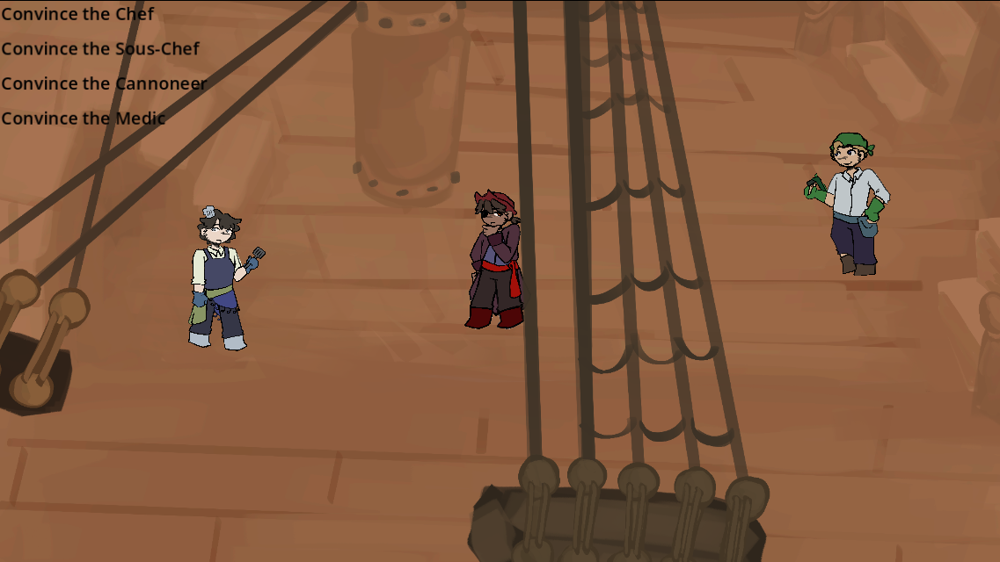
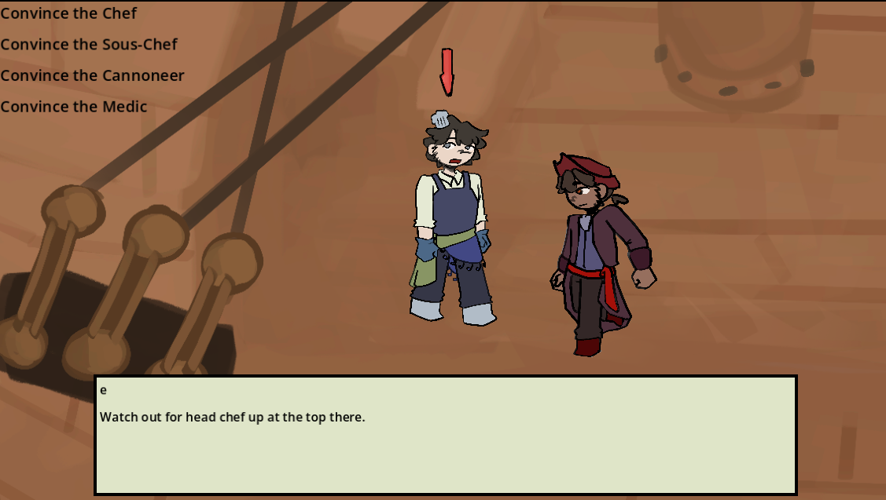

# Lost Treasure Fever

[lochi-makes-games.itch.io/lost-treasure-fever](https://lochi-makes-games.itch.io/lost-treasure-fever)

Talk to people around a pirate ship, you get to name everything in this world.

Made for horizons crux.

## Theme : The crux of storytelling

The crux of storytelling is shown in this game as the ability for storytelling decisions to impact the context of stories. The players are given the power to change the story by choosing the names of objects within the game world.

## Dialogue Format

Dialogue is stored in csv files

The first value in each line is the speaker.
The second value is the action they should be doing
The third value is the line of dialogue to say

e.g.

you,think,This is what I say

## Screenshots

## AI usage

NONE
